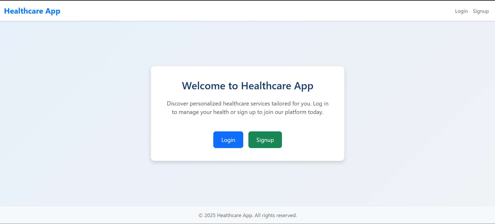

# healthcare-django-app
A web-based healthcare management system built with Django. It supports user registration, login, and role-based dashboards for patients and doctors. Features include profile picture upload, address management, and responsive UI using Bootstrap 5.
# 🏥 Healthcare App

A web-based healthcare management system built with **Django** and **Bootstrap 5**. It provides role-based access for Patients and Doctors with separate dashboards and profile management.

## 🚀 Features

- 👤 User Signup & Login (with profile picture)
- 🧑‍⚕️ Role-based dashboard (Patient or Doctor)
- 📦 Form validation and error handling
- 🎨 Responsive design using Bootstrap 5

## 🛠 Tech Stack

- Backend: **Python 3**, **Django 5**
- Frontend: **HTML**, **Bootstrap 5**
- Database: **SQLite (default)**

## 📂 Folder Structure
healthcare_project/
│
├── accounts/ # User management (models, forms, views)
├── templates/ # HTML templates
├── static/ # Static files (CSS, JS)
├── media/ # Uploaded profile pictures
├── db.sqlite3 # Default database
├── manage.py
└── requirements.txt

## ⚙️ How to Run Locally

1. Clone the repo:
   ```bash
   git clone https://github.com/yourusername/healthcare-django-app.git
   cd healthcare-django-app
   
Create a virtual environment and activate it:
python -m venv myenv
myenv\Scripts\activate  # Windows

Install dependencies:
pip install -r requirements.txt

Run migrations:
python manage.py migrate

Start the server:
python manage.py runserver

Visit: http://127.0.0.1:8000

📸 Screenshots
### 🔐 Home Page


👨‍💻 Author
Raj Khatri– GitHub


